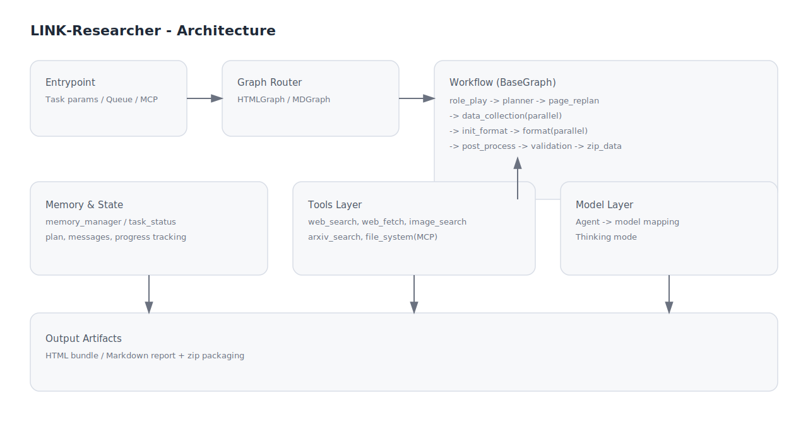
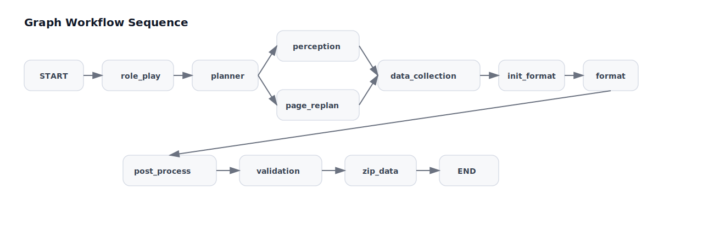

# :material-sitemap-outline: Architecture

本页聚焦系统内部结构，依据 `BaseGraph`、格式子图、内存层与工具层进行拆解。

## 高层架构图




## 运行边界与配置取舍

- **流程边界**：Agent 在图谱节点内执行，结果需经过统一收敛链路。
- **能力边界**：工具能力来自 `src/tools/research/` 的显式注入配置。
- **性能边界**：`FAST_MODE`、搜索数量、递归上限会直接影响耗时与质量。
- **质量边界**：关闭验证可提速，但会增加结构一致性风险。

## 节点拓扑

```text
START
  -> role_play
  -> planner
  -> (perception | page_replan)
  -> data_collection (parallel)
  -> init_design_guide
  -> init_format
  -> format (parallel)
  -> post_process
  -> validation
  -> zip_data
  -> END
```

## 关键机制

### 并行派发

- `send_to_data_collection()`：按 plan 的 `steps` 并行派发采集任务
- `send_to_format()`：按章节并行派发 format 任务，并携带采集结果

### 条件分支

- `send_to_perception()`：检测用户文件是否存在，决定走 `perception` 还是直达 `page_replan`
- `get_validation_agent()`：在 MD 图中受 `ENABLE_VALIDATION` 控制

### 格式图谱差异

- `HTMLGraph`：`validation` 返回 `None`（无校验节点）
- `MDGraph`：可启用 `ValidationMarkdown` 执行事实/结构校验

## 组件分层

<div class="card-grid">
  <article class="wiki-card">
    <h3>Entrypoint</h3>
    <p>`run_flow_fastapi` 协调参数、队列、MCP、图谱执行与清理。</p>
  </article>
  <article class="wiki-card">
    <h3>Graph</h3>
    <p>`BaseGraph` 抽象流程骨架，`HTMLGraph` / `MDGraph` 提供格式实现。</p>
  </article>
  <article class="wiki-card">
    <h3>Memory & State</h3>
    <p>`memoryManager` + `TaskStatus` 保存计划、阶段与中间产物。</p>
  </article>
  <article class="wiki-card">
    <h3>Tools</h3>
    <p>Web Search、Web Fetch、Arxiv、Image Search、FileSystem 等工具协同。</p>
  </article>
</div>

## 时序示意



## 关键模块与源码落点

| 能力域 | 作用 | 关键文件 |
| --- | --- | --- |
| 运行入口 | 解析任务参数、初始化运行时、启动工作流 | `run_flow_fastapi.py` |
| 图谱分流 | 按格式路由到对应 Graph | `src/entrypoint/graph_imports.py` |
| 图谱编排 | 定义节点、条件路由、并行派发 | `src/graph/base_graph.py` |
| 状态与记忆 | 保存 plan / 中间结果 / 会话上下文 | `src/memory/memory_manager.py` |
| 任务状态 | 记录阶段状态与中断信息 | `src/states/task_status.py` |
| 工具层 | 搜索、抓取、图像、ArXiv、文件系统 | `src/tools/research/` |
| 模型管理 | Agent 到模型的映射与加载 | `config/agent_config.py`、`config/model_config.py` |

## 你可以如何扩展

- 新增输出格式：继承 `BaseGraph` 并在 `graph_imports.py` 注册
- 新增工具：在 `src/tools/research/` 增加工具并注入对应 Agent 工厂
- 新增策略模型：在 `config/model_config.py` 注册并在 `config/agent_config.py` 绑定
